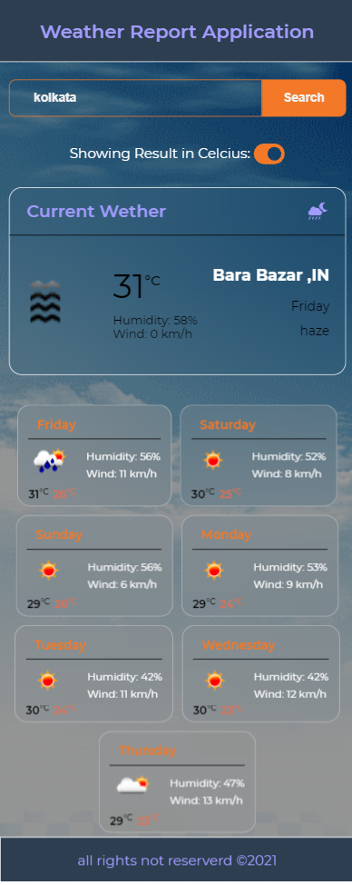

# Weather Forecast Application

This project was bootstrapped with [Create React App](https://github.com/facebook/create-react-app).

download the repo [weather app](https://github.com/fayezkabir/weather-application.git)

then, hit npm install in the terminal
## Available Scripts

In the project directory, you can run:

## `npm start`
it will run the project on port [http://localhost:3000/](http://localhost:3000/)

## `tech use`
for this application I have used [https://openweathermap.org](https://openweathermap.org/api) apis

## `key Features`
at the initial level location access pop up will appear , need to allow that so see the current weather in your area.

you can search any location and hit enter , it will fetch the current and weekly weather and will show in the ui in cards format.

by default the temperature in celcious , you can un check the checkbox to the temperature in Fahrenheit

## Testing
  to run the test cases you can run the below command to terminal and it will run the test cases
## `npm test` 

